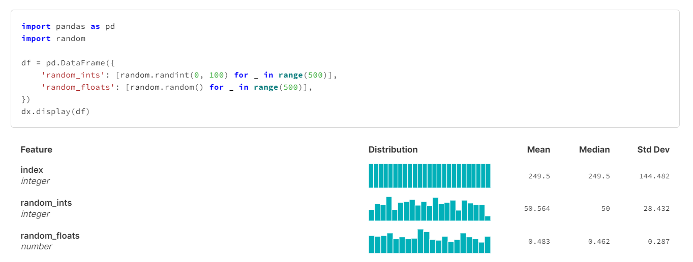
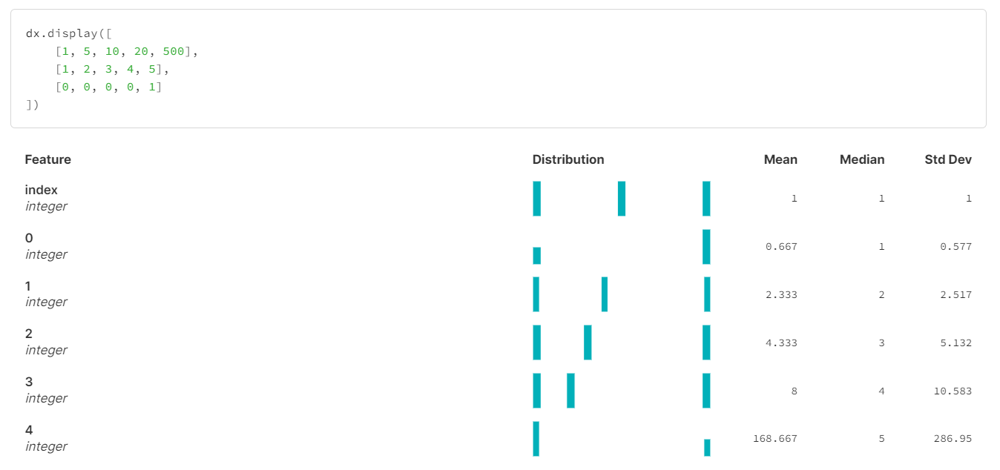
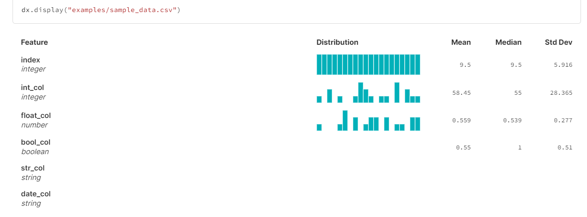
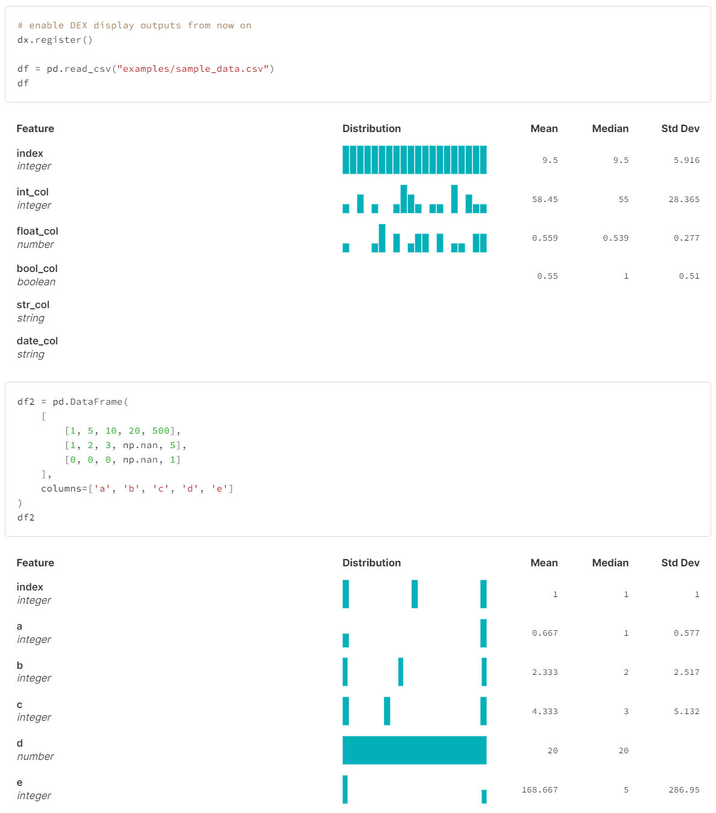
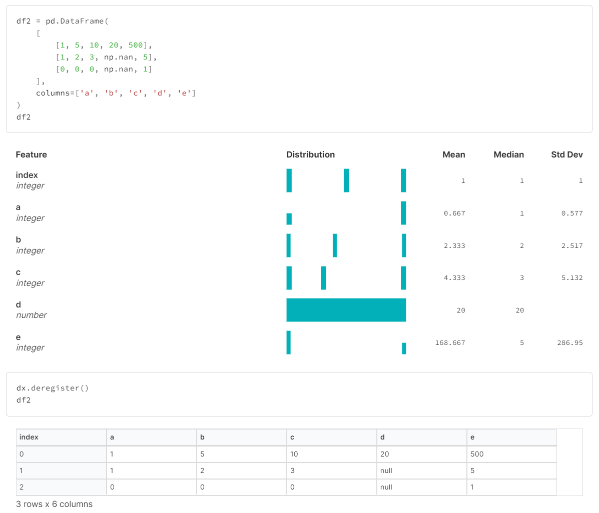

A Pythonic Data Explorer.

# Install

For Python 3.8+:
```
pip install dx>=1.0.3
```

# Usage

The `dx` library currently enables DEX media type visualization of pandas `DataFrames` in two ways:
- individual calls to `dx.display()`
- updating the current IPython display formatter for a session

## Importing
```python
import dx
```

## With `dx.display()`
`dx.display()` will display a single dataset using the DEX media type. It currently supports:
- pandas `DataFrame` objects
  ```python
  import pandas as pd
  import random

  df = pd.DataFrame({
      'random_ints': [random.randint(0, 100) for _ in range(500)],
      'random_floats': [random.random() for _ in range(500)],
  })
  dx.display(df)
  ```
  

- tabular data as `dict` or `list` types
  ```python
  dx.display([
    [1, 5, 10, 20, 500],
    [1, 2, 3, 4, 5],
    [0, 0, 0, 0, 1]
  ])
  ```
  

- `.csv` or `.json` filepaths 

  

## With `dx.register()` and `dx.deregister()`
`dx` will update the current `IPython` display formatters to allow DEX media type visualization of pandas `DataFrame` objects for an entire notebook / kernel session instead of the default `DataFrame` display output.
> Note: this **only** affects pandas DataFrames; it does not affect the display of `.csv`/`.json` file data, or `dict`/`list` outputs

- `dx.register()`
  
  ```python
  import pandas as pd

  # enable DEX display outputs from now on
  dx.register()

  df = pd.read_csv("examples/sample_data.csv")
  df
  ```
  ```python
  df2 = pd.DataFrame(
      [
          [1, 5, 10, 20, 500],
          [1, 2, 3, np.nan, 5],
          [0, 0, 0, np.nan, 1]
      ],
      columns=['a', 'b', 'c', 'd', 'e']
  )
  df2
  ```
  

- `dx.deregister()`
  
  ```python
  df2 = pd.DataFrame(
      [
          [1, 5, 10, 20, 500],
          [1, 2, 3, np.nan, 5],
          [0, 0, 0, np.nan, 1]
      ],
      columns=['a', 'b', 'c', 'd', 'e']
  )
  df2
  ```
  ```python
  dx.deregister()
  df2
  ```
  


# Develop

```
git clone https://github.com/noteable-io/dx
cd ./dx
pip install -e .
```


# Code of Conduct

We follow the noteable.io code of conduct.

# LICENSE

See [LICENSE.md](LICENSE.md).