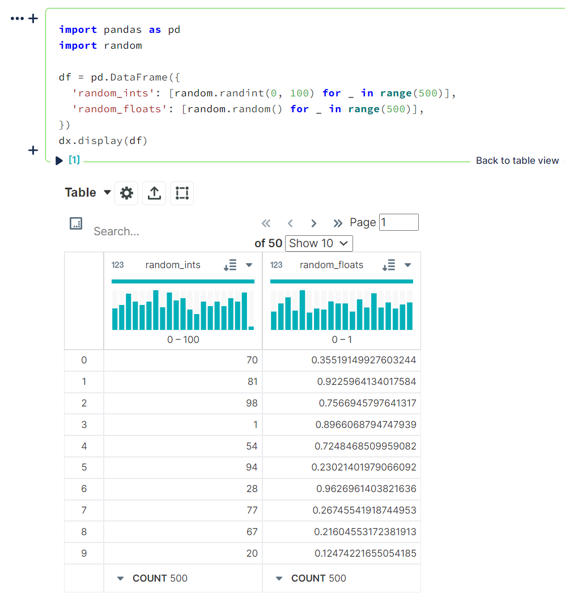
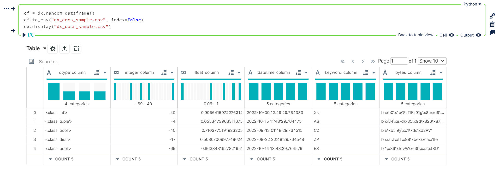

# dx

<p align="center">
This package provides convenient formatting and IPython display formatter registration for tabular data and DEX media types.
</p>
<p align="center">
<a href="https://github.com/noteable-io/dx/actions/workflows/ci.yaml">
    
</a>
<a href="https://codecov.io/gh/noteable-io/dx" > 
  
 </a>


<a href="https://github.com/psf/black"></a>
</p>

---------

A Pythonic Data Explorer, open sourced with ❤️ by <a href="https://noteable.io">Noteable</a>, a collaborative notebook platform that enables teams to use and visualize data, together.


## Requirements

Python 3.8+

## Installation

### Poetry

```shell
poetry add dx
```

Then import the package:

```python
import dx
```

### Pip
```shell
pip install dx
```

Then import the package:

```python
import dx
```

## Usage

The `dx` library currently enables DEX media type visualization of pandas `DataFrame` and `Series` objects, as well as numpy `ndarray` objects. This can be handled in two ways:
- explicit `dx.display()` calls
- setting the `display_mode` to update the IPython display formatter for a session

### With `dx.display()`
`dx.display()` will display a single dataset using the DEX media type. It currently supports:
- pandas `DataFrame` objects
  ```python
  import pandas as pd
  import random

  df = pd.DataFrame({
      'random_ints': [random.randint(0, 100) for _ in range(500)],
      'random_floats': [random.random() for _ in range(500)],
  })
  dx.display(df)
  ```
  

- tabular data as `dict` or `list` types
  ```python
  dx.display([
    [1, 5, 10, 20, 500],
    [1, 2, 3, 4, 5],
    [0, 0, 0, 0, 1]
  ])
  ```
  

- `.csv` or `.json` filepaths 
  ```python
  df = dx.random_dataframe()
  df.to_csv("dx_docs_sample.csv", index=False)

  dx.display("dx_docs_sample.csv")
  ```
  

### With `dx.set_display_mode()`
Using either `"simple"` or `"enhanced"` display modes will allow `dx` will update the current `IPython` display formatters to allow DEX media type visualization of pandas `DataFrame` objects for an entire notebook / kernel session instead of the default `DataFrame` display output.

<details>
<summary>Details</summary>

This will adjust pandas options to:
- increasing the number of rows displayed to `50000` from pandas default of `60`
- increasing the number of columns displayed to `50` from pandas default of `20`
- enabling `html.table_schema` (`False` by default in pandas)

This will also handle some basic column cleaning and generate a schema for the `DataFrame` using `pandas.io.json.build_table_schema`. Depending on the display mode, the data will be transformed into either a list of dictionaries or list of lists of columnar values.
- `"simple"` - list of dictionaries
- `"enhanced"` - list of lists
</details>

> **NOTE:**
> Unlike `dx.display()`, this **only** affects pandas DataFrames (or any types set in `settings.RENDERABLE_OBJECTS`); it does not affect the display of `.csv`/`.json` file data, or `dict`/`list` outputs


- `dx.set_display_mode("simple")`
  
  ```python
  import dx
  import numpy as np
  import pandas as pd

  # enable DEX display outputs from now on
  dx.set_display_mode("simple")

  df = pd.read_csv("dx_docs_sample.csv")
  df
  ```
  ```python
  df2 = pd.DataFrame(
      [
          [1, 5, 10, 20, 500],
          [1, 2, 3, np.nan, 5],
          [0, 0, 0, np.nan, 1]
      ],
      columns=['a', 'b', 'c', 'd', 'e']
  )
  df2
  ```
  

If, at any point, you want to go back to the default display formatting (vanilla pandas output), use the `"plain"` display mode. This will revert the IPython display format update to its original state and put the pandas options back to their default values.

- `dx.set_display_mode("plain")`
  ```python
  # revert to original pandas display outputs from now on
  dx.set_display_mode("plain")

  df = pd.read_csv("dx_docs_sample.csv")
  df
  ```
  ```python
  df2 = pd.DataFrame(
      [
          [1, 5, 10, 20, 500],
          [1, 2, 3, np.nan, 5],
          [0, 0, 0, np.nan, 1]
      ],
      columns=['a', 'b', 'c', 'd', 'e']
  )
  df2
  ```
  


### Custom Settings
Default settings for `dx` can be found by calling `dx.settings`:


Each can be set using `dx.set_option()`:

_Setting `DISPLAY_MAX_ROWS` to `3` for the current session_

...or with the `dx.settings_context()` context manager:

_Setting `DISPLAY_MAX_ROWS` to `3` within the current context, leaving options for the rest of the session alone_

### Generating Sample Data
Documentation coming soon!

### Usage Outside of Noteable 
If using this package in a notebook environment outside of [Noteable](https://app.noteable.io/), the frontend should support the following media types:
- `application/vnd.dataresource+json` for `"simple"` display mode
- `application/vnd.dex.v1+json` for `"enhanced"` display mode
## Contributing

See [CONTRIBUTING.md](https://github.com/noteable-io/dx/blob/main/CONTRIBUTING.md).

## Code of Conduct

We follow the noteable.io [code of conduct](CODE_OF_CONDUCT.md).

## LICENSE

See [LICENSE.md](LICENSE.md).

-------

<p align="center">Open sourced with ❤️ by <a href="https://noteable.io">Noteable</a> for the community.</p>

