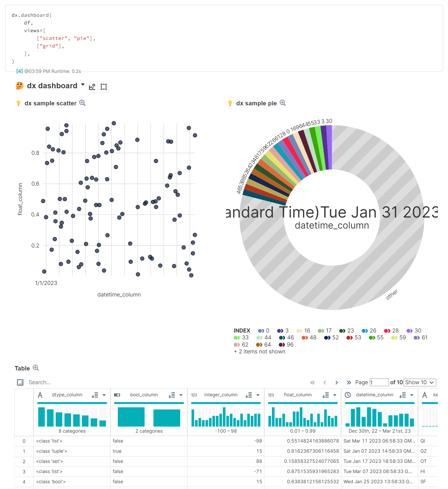
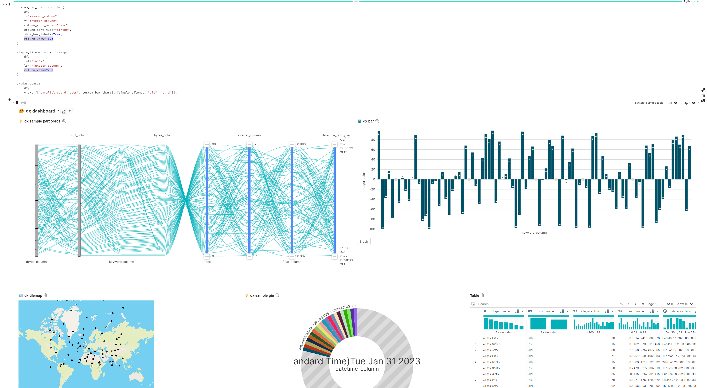
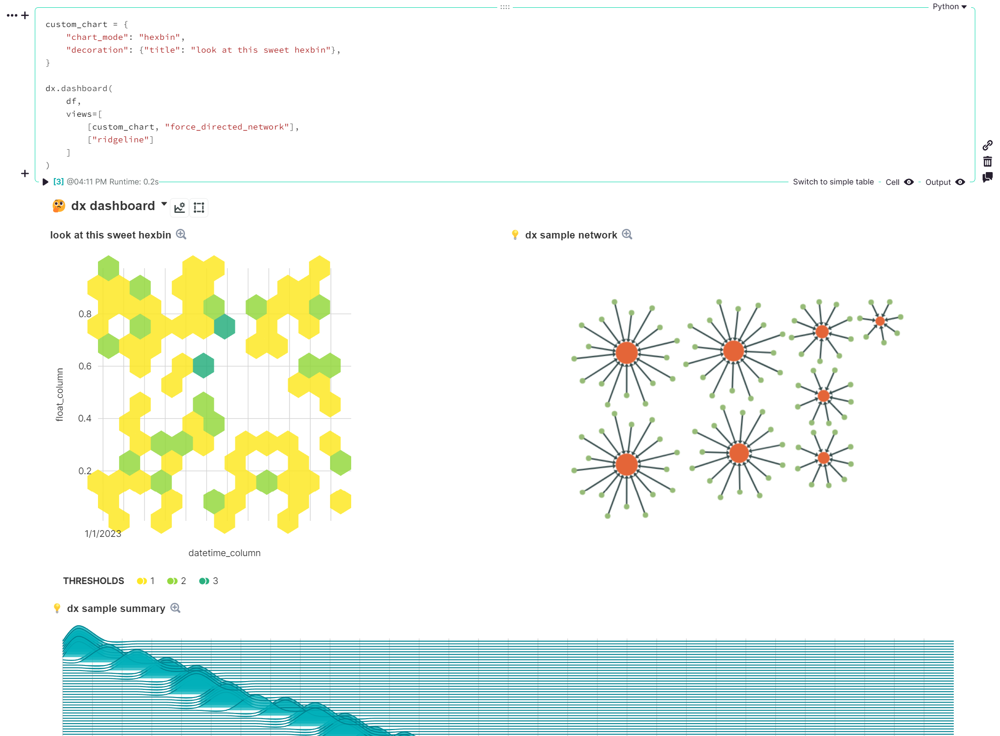

<!-- --8<-- [start:usage] -->
Just like the [plotting](../../../plotting/overview/#plotting) functions, generating dashboards with `dx` is **very** experimental and prone to change.
## [Making a Dashboard](../../reference/charts/basic_charts/#src.dx.plotting.dashboards.dashboard)
If you create charts using `dx` functions, you may want to combine them into a single view or **dashboard**. This can be done with `dashboard()`.

Similar to the chart functions, `dashboard()` mainly requires a pandas DataFrame, as well as a list of views in a matrix-like orientation. (Each item in the list is treated as a row, and each row can be a list of views to specify column positioning.) 

### Simple
Here's a quick example where we make a dashboard using two rows -- the top row will have [scatter](../../../plotting/basic_charts/#scatter) and [bar](../../../plotting/basic_charts/#bar) charts, and the bottom will be our default grid view:

```python
dx.dashboard(
    df,
    views=[
        ['scatter', 'bar'],
        ['grid'],
    ]
)
```


### With Chart Views
Using chart functions, you can specify `return_view=True` and pass the resulting `DEXView` object into a dashboard. 


### Customized
If you want to provide some additional arguments, instead of passing a string to indicate the chart type, you can pass a dictionary with `{"chart_mode": CHART TYPE, **extra_kwargs}`.
```python
custom_dotplot = {
    'chart_mode': 'dotplot', 
    'decoration': {
        'title': 'look at this sweet dot plot'
    }
}

dx.dashboard(
    df,
    views=[
        [custom_dotplot, 'force_directed_network'],
        ['scatter']
    ]
)
```


<!-- --8<-- [end:usage] -->

<!-- --8<-- [start:ref] -->
## [Making a Dashboard](../../../plotting/overview/#making_a_dashboard)
::: src.dx.plotting.dashboards.dashboard
<!-- --8<-- [end:ref] -->