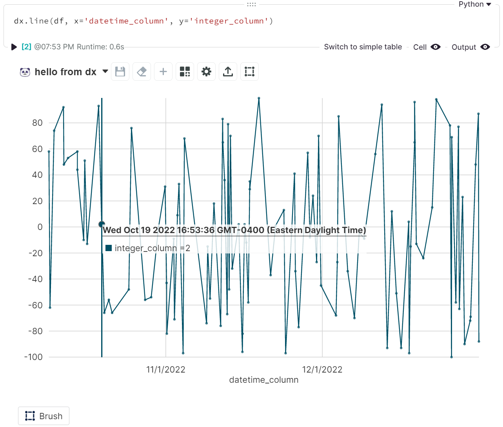
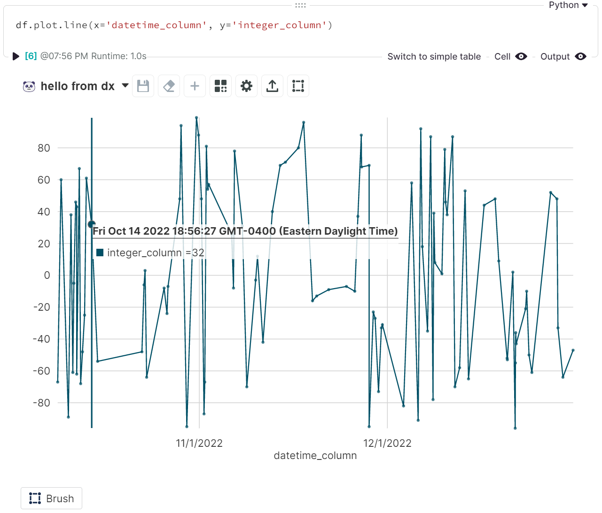
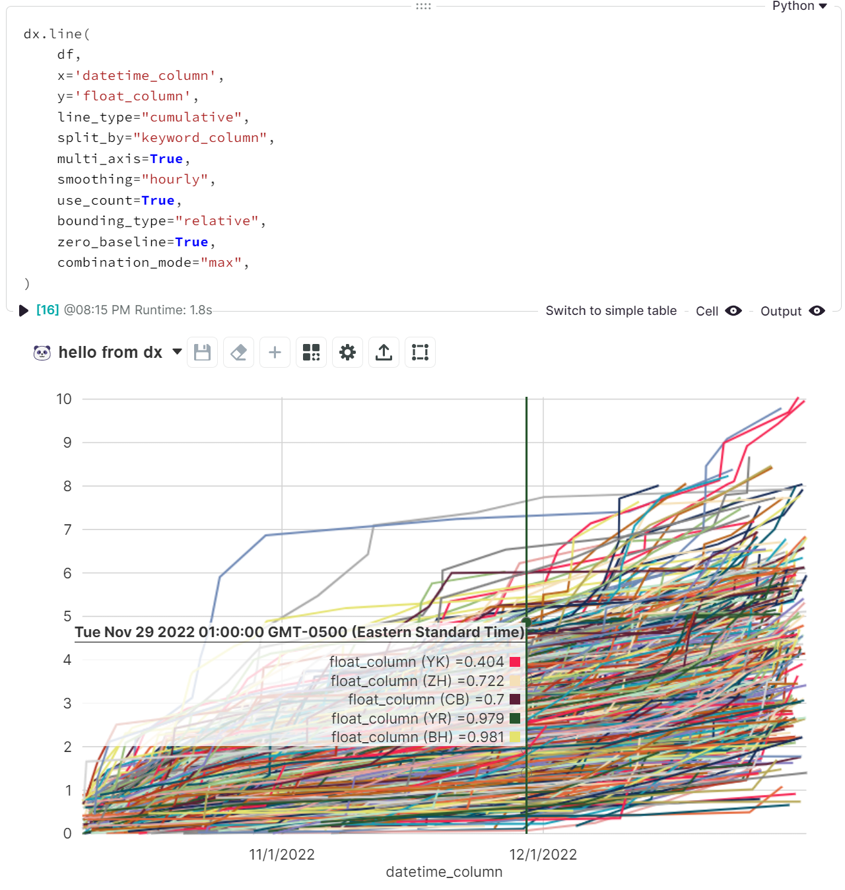

<!-- --8<-- [start:usage] -->
## [Line](../../reference/charts/basic_charts/#src.dx.plotting.dex.basic.line)

### Simple
=== "dx"

    ```python
    dx.line(df, x='datetime_column', y='integer_column')
    ```
    

=== "pd.options.plotting.backend = 'dx'"

    !!! info "Make sure you [enable `dx` as a pandas plotting backend](../plotting/overview.md#enabling-pandas-plotting-backend) first."

    ```python
    df.plot.line(x='datetime_column', y='integer_column')
    ```
    
    
### Customized
You may need to use a larger dataset to see the changes here. For these examples, we used `dx.random_dataframe(5000)`.

=== "dx"

    ```python
    dx.line(
        df, 
        x='datetime_column', 
        y='integer_column',
        line_type="cumulative",
        split_by="keyword_column",
        multi_axis=True,
        smoothing="hourly",
        use_count=True,
        bounding_type="relative",
        zero_baseline=True,
        combination_mode="min",
    )
    ```
    

=== "pd.options.plotting.backend = 'dx'"

    !!! info "Make sure you [enable `dx` as a pandas plotting backend](../plotting/overview.md#enabling-pandas-plotting-backend) first."

    ```python
    df.plot.line(
        x='datetime_column', 
        y='integer_column',
        line_type="cumulative",
        split_by="keyword_column",
        multi_axis=True,
        smoothing="hourly",
        use_count=True,
        bounding_type="relative",
        zero_baseline=True,
        combination_mode="min",
    )
    ```
    
<!-- --8<-- [end:usage] -->

<!-- --8<-- [start:ref] -->
## [Line](../../../plotting/basic_charts/#line)
::: src.dx.plotting.dex.basic.line
<!-- --8<-- [end:ref] -->