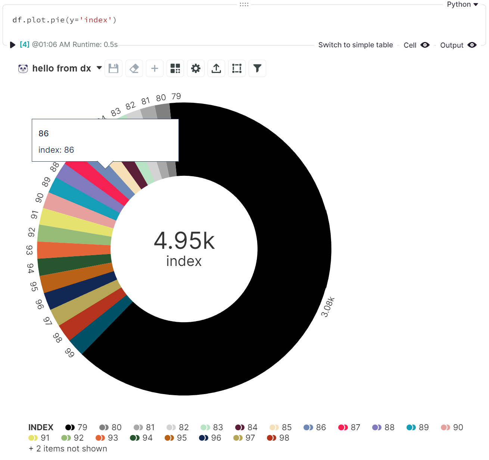

<!-- --8<-- [start:usage] -->
## [Pie](../../reference/charts/basic_charts/#src.dx.plotting.dex.basic.pie)

### Simple
=== "dx"

    ```python
    dx.pie(df, y='index')
    ```
    

=== "pd.options.plotting.backend = 'dx'"

    !!! info "Make sure you [enable `dx` as a pandas plotting backend](../plotting/overview.md#enabling-pandas-plotting-backend) first."

    ```python
    df.plot.pie(y='index')
    ```
    
    
### Customized
=== "dx"
    ```python
    dx.pie(
        df, 
        y='index',
        split_slices_by='keyword_column',
        show_total=False,
        pie_label_type='annotation',
        pie_label_contents='percent',
    )
    ```
    

=== "pd.options.plotting.backend = 'dx'"

    !!! info "Make sure you [enable `dx` as a pandas plotting backend](../plotting/overview.md#enabling-pandas-plotting-backend) first."

    ```python
    df.plot.pie(
        y='index',
        split_slices_by='keyword_column',
        show_total=False,
        pie_label_type='annotation',
        pie_label_contents='percent',
    )
    ```
    
<!-- --8<-- [end:usage] -->

<!-- --8<-- [start:ref] -->
## [Pie](../../../plotting/basic_charts/#pie)
::: src.dx.plotting.dex.basic.pie
<!-- --8<-- [end:ref] -->