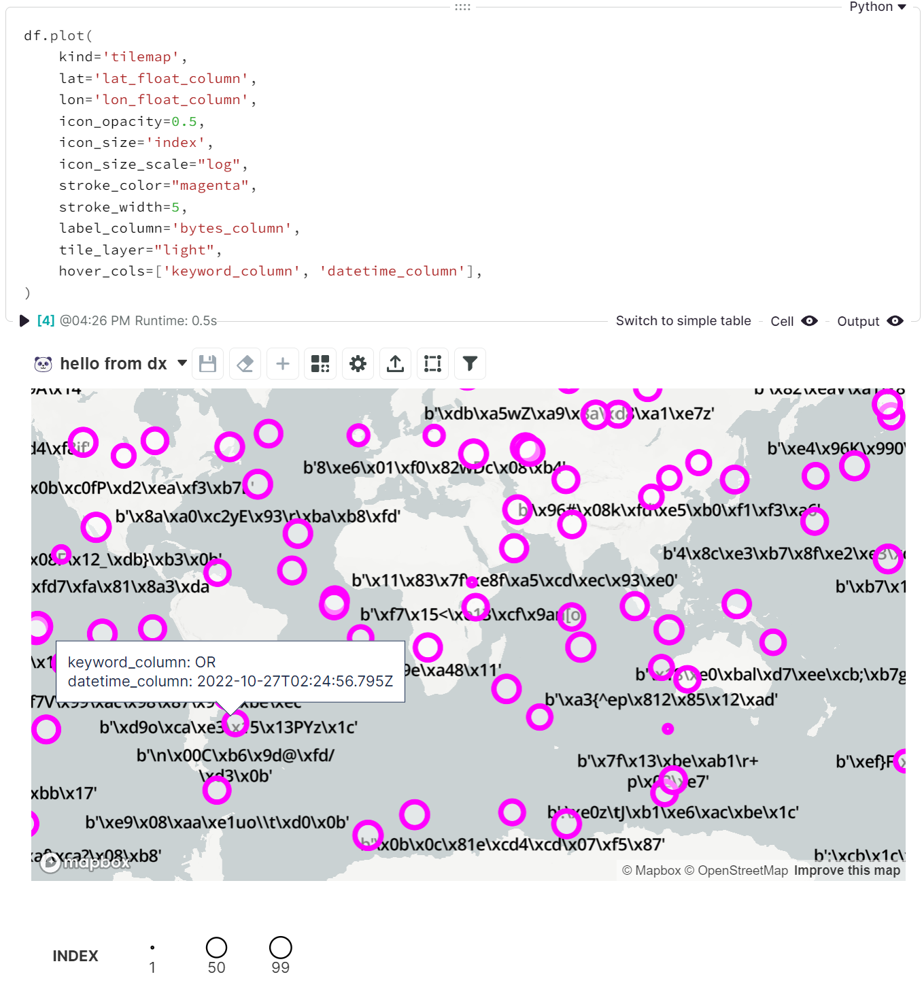

<!-- --8<-- [start:usage] -->
## [Tilemap](../../reference/charts/maps/#src.dx.plotting.dex.map_charts.tilemap)
Since `dx.random_dataframe()` returns `integer_column` values (`-100` to `100`) and `float_column` values (`0.0` to `1.0`) as the only numeric columns by default, we can suggest enabling the `lat_float_column` and `lon_float_column` arguments for some quick testing:
```python
df = dx.random_dataframe(100, lat_float_column=True, lon_float_column=True)
```

!!! info ""
    More about how Noteable builds with Mapbox [here](https://www.mapbox.com/showcase/noteable). 🗺️
### Simple
=== "dx"

    ```python
    dx.tilemap(df, lon='lon_float_column', lat='lat_float_column')
    ```
    

=== "pd.options.plotting.backend = 'dx'"

    !!! info "Make sure you [enable `dx` as a pandas plotting backend](../plotting/overview.md#enabling-pandas-plotting-backend) first."

    ```python
    df.plot(kind='tilemap', lon='lon_float_column', lat='lat_float_column')
    ```
    _*Note you can't use `df.plot.tilemap()` directly_

    
    
### Customized
=== "dx"

    ```python
    dx.tilemap(
        df,
        lat='lat_float_column',
        lon='lon_float_column',
        icon_opacity=0.5,
        icon_size='index',
        icon_size_scale="log",
        stroke_color="magenta",
        stroke_width=5,
        label_column='bytes_column',
        tile_layer="light",
        hover_cols=['keyword_column', 'datetime_column'],
    )
    ```
    

=== "pd.options.plotting.backend = 'dx'"

    !!! info "Make sure you [enable `dx` as a pandas plotting backend](../plotting/overview.md#enabling-pandas-plotting-backend) first."

    ```python
    df.plot(
        kind='tilemap',
        lat='lat_float_column',
        lon='lon_float_column',
        icon_opacity=0.5,
        icon_size='index',
        icon_size_scale="log",
        stroke_color="magenta",
        stroke_width=5,
        label_column='bytes_column',
        tile_layer="light",
        hover_cols=['keyword_column', 'datetime_column'],
    )

    ```
    _*Note you can't use `df.plot.tilemap()` directly_

    
<!-- --8<-- [end:usage] -->

<!-- --8<-- [start:ref] -->
## [Tilemap](../../../plotting/maps/#tilemap)
::: src.dx.plotting.dex.map_charts.tilemap
<!-- --8<-- [end:ref] -->