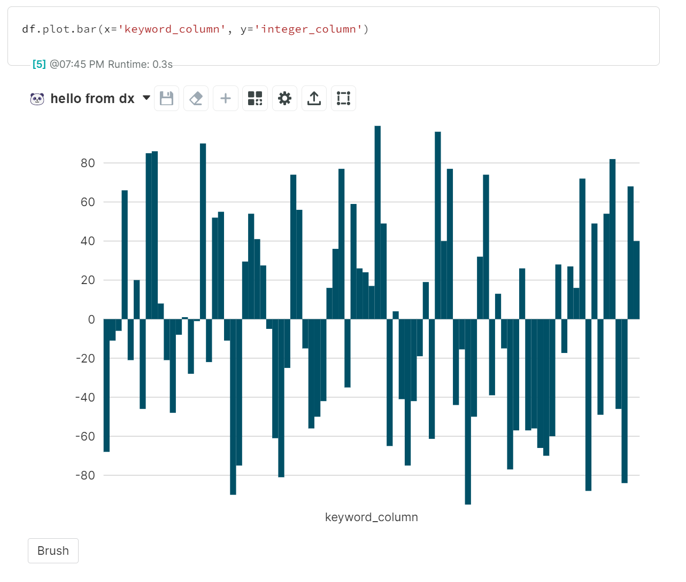
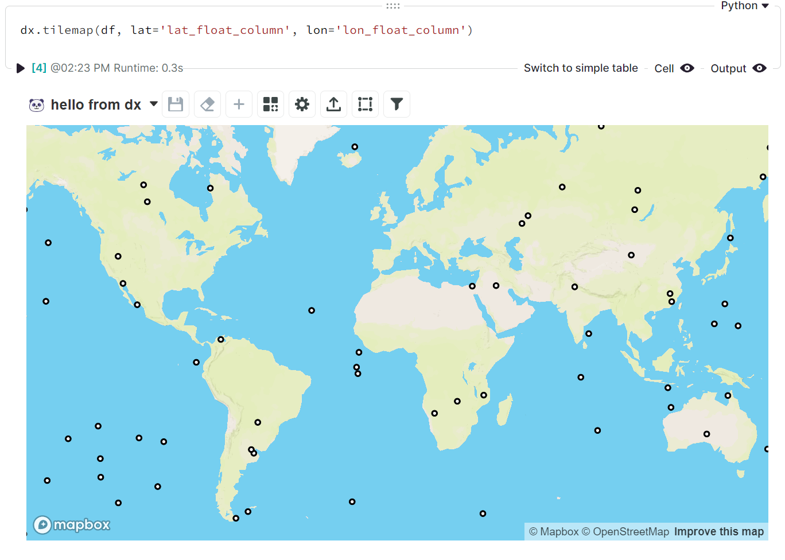

# Basic Charts

Here we'll talk about how to plot some basic chart types in DEX using `dx`.

We will be using our own built-in DataFrame generation function for these visualizations.
The values you see may be different if you run the same code in a cell, but the column structure should be very similar (if not identical).
```python
df = dx.random_dataframe(100)
```

!!! warning "The _**Customized**_ examples with more options do not necessarily represent "good" data visualization; they are just a glimpse into what settings are available to compare with the simple examples."    

## [Bar](../../reference/basic_charts/#src.dx.plotting.dex.basic.bar)
### Simple
=== "dx"

    ```python
    dx.bar(df, x='keyword_column', y='integer_column')
    ```
    

=== "pd.options.plotting.backend = 'dx'"

    !!! info "Make sure you [enable `dx` as a pandas plotting backend](overview.md#enabling-pandas-plotting-backend) first."

    ```python
    df.plot.bar(x='keyword_column', y='integer_column')
    ```
    

### Customized

=== "dx"

    ```python
    dx.bar(
        df, 
        x='keyword_column', 
        y='integer_column',
        y2='float_column',
        y2_style='dot',
        horizontal=True,
        bar_width='index',
        group_other=True,
        column_sort_order="desc",
        column_sort_type="string",
        pro_bar_mode="combined",
        combination_mode="max",
        show_bar_labels=True,
    )
    ```
    

=== "pd.options.plotting.backend = 'dx'"

    !!! info "Make sure you [enable `dx` as a pandas plotting backend](overview.md#enabling-pandas-plotting-backend) first."

    ```python
    df.plot.bar(
        x='keyword_column', 
        y='integer_column',
        y2='float_column',
        y2_style='dot',
        horizontal=True,
        bar_width='index',
        group_other=True,
        column_sort_order="desc",
        column_sort_type="string",
        pro_bar_mode="combined",
        combination_mode="max",
        show_bar_labels=True,
    )
    ```
    

## [Line](../../reference/dex_plotting/#src.dx.plotting.dex.basic.line)

### Simple
=== "dx"

    ```python
    dx.line(df, x='datetime_column', y='integer_column')
    ```
    

=== "pd.options.plotting.backend = 'dx'"

    !!! info "Make sure you [enable `dx` as a pandas plotting backend](overview.md#enabling-pandas-plotting-backend) first."

    ```python
    df.plot.line(x='datetime_column', y='integer_column')
    ```
    
    
### Customized
You may need to use a larger dataset to see the changes here. For these examples, we used `dx.random_dataframe(5000)`.

=== "dx"
    ```python
    dx.line(
        df, 
        x='datetime_column', 
        y='integer_column',
        line_type="cumulative",
        split_by="keyword_column",
        multi_axis=True,
        smoothing="hourly",
        use_count=True,
        bounding_type="relative",
        zero_baseline=True,
        combination_mode="min",
    )
    ```
    

=== "pd.options.plotting.backend = 'dx'"

    !!! info "Make sure you [enable `dx` as a pandas plotting backend](overview.md#enabling-pandas-plotting-backend) first."

    ```python
    df.plot.line(
        x='datetime_column', 
        y='integer_column',
        line_type="cumulative",
        split_by="keyword_column",
        multi_axis=True,
        smoothing="hourly",
        use_count=True,
        bounding_type="relative",
        zero_baseline=True,
        combination_mode="min",
    )
    ```
    

    
## [Pie](../../reference/dex_plotting/#src.dx.plotting.dex.basic.pie)

### Simple
=== "dx"

    ```python
    dx.pie(df, y='index')
    ```
    

=== "pd.options.plotting.backend = 'dx'"

    !!! info "Make sure you [enable `dx` as a pandas plotting backend](overview.md#enabling-pandas-plotting-backend) first."

    ```python
    df.plot.pie(y='index')
    ```
    
    
### Customized
=== "dx"
    ```python
    dx.pie(
        df, 
        y='index',
        split_slices_by='keyword_column',
        show_total=False,
        pie_label_type='annotation',
        pie_label_contents='percent',
    )
    ```
    

=== "pd.options.plotting.backend = 'dx'"

    !!! info "Make sure you [enable `dx` as a pandas plotting backend](overview.md#enabling-pandas-plotting-backend) first."

    ```python
    df.plot.pie(
        y='index',
        split_slices_by='keyword_column',
        show_total=False,
        pie_label_type='annotation',
        pie_label_contents='percent',
    )
    ```
    

## [Scatter](../../reference/dex_plotting/#src.dx.plotting.dex.basic.scatterplot)

### Simple
=== "dx"

    ```python
    dx.scatter(df, x='float_column', y='integer_column')
    ```
    

=== "pd.options.plotting.backend = 'dx'"

    !!! info "Make sure you [enable `dx` as a pandas plotting backend](overview.md#enabling-pandas-plotting-backend) first."

    ```python
    df.plot.scatter(x='float_column', y='integer_column')
    ```
    
    
### Customized
=== "dx"
    ```python
    dx.scatter(
        df, 
        x='float_column', 
        y='integer_column',
        size='index',
        trend_line='polynomial',
        marginal_graphics='histogram',
        formula_display='r2'
    )
    ```
    

=== "pd.options.plotting.backend = 'dx'"

    !!! info "Make sure you [enable `dx` as a pandas plotting backend](overview.md#enabling-pandas-plotting-backend) first."

    ```python
    df.plot.scatter(
        x='float_column', 
        y='integer_column',
        size='index',
        trend_line='polynomial',
        marginal_graphics='histogram',
        formula_display='r2'
    )
    ```
    

## [Tilemap](../../reference/dex_plotting/#src.dx.plotting.dex.basic.tilemap)
Since `dx.random_dataframe()` returns `integer_column` values (`-100` to `100`) and `float_column` values (`0.0` to `1.0`) as the only numeric columns by default, we can suggest enabling the `lat_float_column` and `lon_float_column` arguments for some quick testing:
```python
df = dx.random_dataframe(100, lat_float_column=True, lon_float_column=True)
```
### Simple
=== "dx"

    ```python
    dx.tilemap(df, lon='lon_float_column', lat='lat_float_column')
    ```
    

=== "pd.options.plotting.backend = 'dx'"

    !!! info "Make sure you [enable `dx` as a pandas plotting backend](overview.md#enabling-pandas-plotting-backend) first."

    ```python
    df.plot.tilemap(lon='lon_float_column', lat='lat_float_column')
    ```
    
    
### Customized
=== "dx"
    ```python
    dx.tilemap(
        df, 
        lon='lon_float_column',
        lat='lat_float_column',
        ...
    )
    ```
    

=== "pd.options.plotting.backend = 'dx'"

    !!! info "Make sure you [enable `dx` as a pandas plotting backend](overview.md#enabling-pandas-plotting-backend) first."

    ```python
    df.plot.tilemap(
        lon='lon_float_column',
        lat='lat_float_column',
        ...
    )
    ```
    

## [Violin](../../reference/dex_plotting/#src.dx.plotting.dex.basic.violin)

### Simple
=== "dx"

    ```python
    dx.violin(df, x='keyword_column', y='integer_column')
    ```
    

=== "pd.options.plotting.backend = 'dx'"

    !!! info "Make sure you [enable `dx` as a pandas plotting backend](overview.md#enabling-pandas-plotting-backend) first."

    ```python
    df.plot.violin(x='keyword_column', y='integer_column')
    ```
    
    
### Customized
=== "dx"
    ```python
    dx.violin(
        df, 
        x='float_column',
        y='integer_column',
        ...
    )
    ```
    

=== "pd.options.plotting.backend = 'dx'"

    !!! info "Make sure you [enable `dx` as a pandas plotting backend](overview.md#enabling-pandas-plotting-backend) first."

    ```python
    df.plot.violin(
        x='float_column',
        y='integer_column',
        ...
    )
    ```
    

## [Wordcloud](../../reference/dex_plotting/#src.dx.plotting.dex.basic.wordcloud)
### Simple
=== "dx"

    ```python
    dx.wordcloud(df, word_column='keyword_column', size='float_column')
    ```
    

=== "pd.options.plotting.backend = 'dx'"

    !!! info "Make sure you [enable `dx` as a pandas plotting backend](overview.md#enabling-pandas-plotting-backend) first."

    ```python
    df.plot.wordcloud(word_column='keyword_column', size='float_column')
    ```
    
    
### Customized
=== "dx"
    ```python
    dx.wordcloud(
        df, 
        word_column='keyword_column',
        size='float_column',
        ...
    )
    ```
    

=== "pd.options.plotting.backend = 'dx'"

    !!! info "Make sure you [enable `dx` as a pandas plotting backend](overview.md#enabling-pandas-plotting-backend) first."

    ```python
    df.plot.wordcloud(
        word_column='keyword_column',
        size='float_column',
        ...
    )
    ```
    