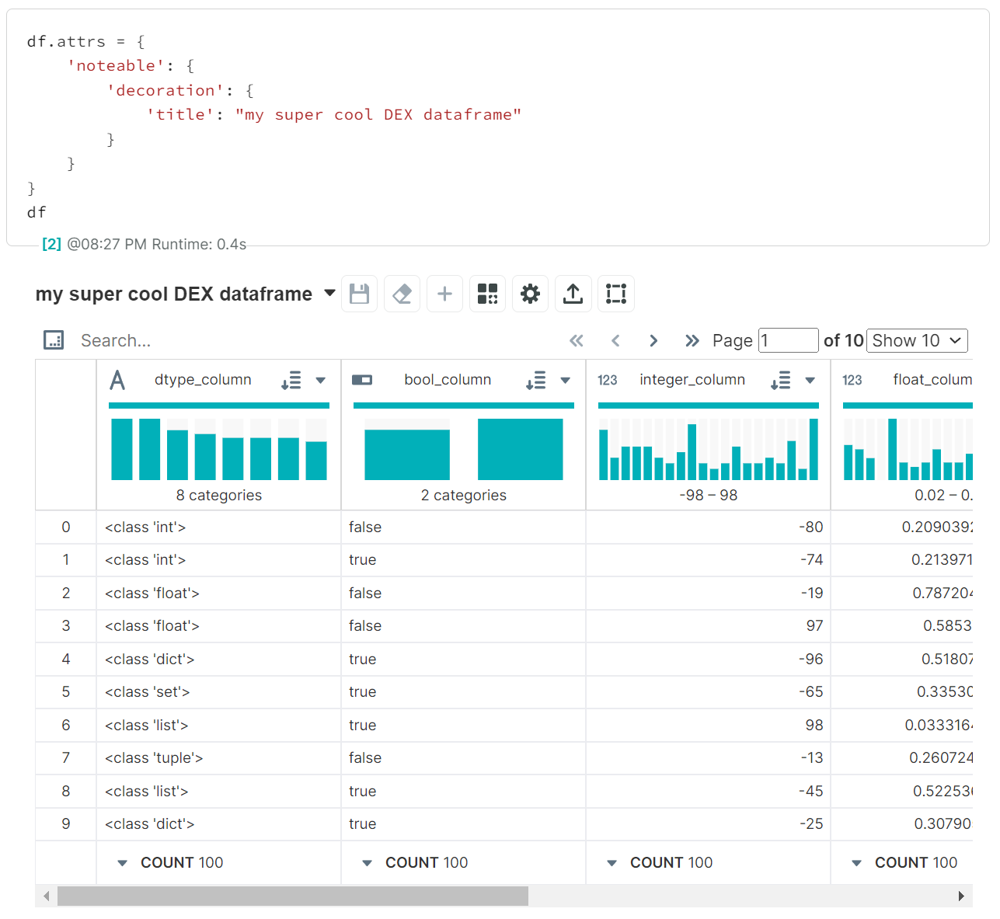

# Overview

If you've ever worked with DEX, you may come up with the perfect visualization or dashboard and want to carry it with you to other notebooks. This can be accomplished by using `dx`'s built-in convenience functions.

## Using pandas DataFrame `.attrs`
Set `.attrs` to customize your DEX display any time your pandas DataFrame is displayed.
```python
df.attrs = {
    'noteable': {
        'decoration': {
            'title': "my super cool DEX dataframe"
        }
    }
}
df
```


## Plotting

This is still **very** experimental. Any of the charts checked below indicate basic rendering should work (and allow manual user interactions in DEX), but not all combinations of plot arguments have been tested. Feedback welcome!

For official DEX chart documentation, visit https://docs.noteable.io/product-docs/visualize-data/dex-charts. 
### Supported Charts

- #### [Basic Charts](../plotting/basic_charts.md)
    * [x] [Bar](../plotting/basic_charts.md#bar)
    * [x] [Line](../plotting/basic_charts.md#line)
    * [x] [Pie](../plotting/basic_charts.md#pie)
    * [x] [Scatterplot](../plotting/basic_charts.md#scatterplot)
    * [x] [Violin](../plotting/basic_charts.md#violin)
    * [x] [Wordcloud](../plotting/basic_charts.md#wordcloud)

- #### [Comparison Charts](../plotting/comparison_charts.md)
    * [ ] [Parallel Coordinates](../plotting/comparison_charts.md#parallel_coordinates)
    * [x] [Scatterplot](../plotting/comparison_charts.md#scatterplot)
    * [ ] [Connected Scatterplot](../plotting/comparison_charts.md#connected_scatterplot)
    * [ ] [Scatterplot Matrix](../plotting/comparison_charts.md#scatterplot_matrix)
    * [ ] [Correlation Matrix](../plotting/comparison_charts.md#correlation_matrix)
    * [x] [Bar](../plotting/comparison_charts.md#bar)
    * [ ] [Dot Plot](../plotting/comparison_charts.md#dotplot)
    * [ ] [Radar Plot](../plotting/comparison_charts.md#radar_plot)
    * [ ] [Diverging Bar](../plotting/comparison_charts.md#diverging_bar)
  
- #### [Time Series Charts](../plotting/time_series_charts.md)
    * [x] [Line](../plotting/time_series_charts.md#line)
    * [ ] [Cumulative](../plotting/time_series_charts.md#cumulative)
    * [ ] [Stacked Area](../plotting/time_series_charts.md#stacked_area)
    * [ ] [Line Percent](../plotting/time_series_charts.md#line_percent)
    * [ ] [Stacked Percent](../plotting/time_series_charts.md#stacked_percent)
    * [ ] [Candlestick](../plotting/time_series_charts.md#candlestick)

- #### [Relationship Charts](../plotting/relationship_charts.md)
    * [ ] [Force-directed Network](../plotting/relationship_charts.md#force_directed_network)
    * [ ] [Sankey](../plotting/relationship_charts.md#sankey)
    * [ ] [Arc Diagram](../plotting/relationship_charts.md#arc_diagram)
    * [ ] [Adjacency Matrix](../plotting/relationship_charts.md#adjacency_matrix)
    * [ ] [Dendrogram](../plotting/relationship_charts.md#dendrogram)

- #### [Part-to-whole Charts](../plotting/part_to_whole_charts.md)
    * [x] [Pie](../plotting/part_to_whole_charts.md#pie)
    * [ ] [Donut](../plotting/part_to_whole_charts.md#donut)
    * [ ] [Sunburst](../plotting/part_to_whole_charts.md#sunburst)
    * [ ] [Treemap](../plotting/part_to_whole_charts.md#treemap)
    * [ ] [Partition](../plotting/part_to_whole_charts.md#partition)

- #### [Funnel Charts](../plotting/funnel_charts.md)
    * [ ] [Funnel](../plotting/funnel_charts.md#funnel)
    * [ ] [Funnel Chart](../plotting/funnel_charts.md#funnel_chart)
    * [ ] [Funnel Tree](../plotting/funnel_charts.md#funnel_tree)
    * [ ] [Funnel Sunburst](../plotting/funnel_charts.md#funnel_sunburst)
    * [ ] [Flow Diagram](../plotting/funnel_charts.md#flow_diagram)
    * [ ] [Arc Flow](../plotting/funnel_charts.md#arc_flow)

- #### [Summary Charts](../plotting/summary_charts.md)
    * [ ] [Big Number](../plotting/summary_charts.md#big_number)
    * [x] [Wordcloud](../plotting/summary_charts.md#wordcloud)
    * [ ] [Dimension Matrix](../plotting/summary_charts.md#dimension_matrix)
    * [x] [Violin](../plotting/summary_charts.md#violin)
    * [ ] [Box Plot](../plotting/summary_charts.md#boxplot)
    * [ ] [Heat Map](../plotting/summary_charts.md#heatmap)
    * [ ] [Histogram](../plotting/summary_charts.md#histogram)
    * [ ] [Ridgeline](../plotting/summary_charts.md#ridgeline)
    * [ ] [Horizon](../plotting/summary_charts.md#horizon)
    * [ ] [Hexbin](../plotting/summary_charts.md#hexbin)

- #### [Maps](../plotting/maps.md)
    * [ ] [Choropleth](../plotting/maps.md#choropleth)
    * [x] [Tilemap](../plotting/maps.md#tilemap)

### Enabling pandas plotting backend
To enable the `dx` plotting backend and use `DataFrame.plot._____` or `DataFrame.plot(kind=_____)` syntax, you can run either of the following:
```python
dx.enable_plotting_backend()
```
Or
```python
pd.options.plotting.backend = "dx"
```
(They currently do the same thing, but `dx.enable_plotting_backend()` may handle more convenience functionality in the future.)

!!! warning
    Not all chart options above can be called using the `DataFrame.plot.______()` pattern. Some examples:

    - `df.plot.violin(**kwargs)` should instead be `df.plot(kind='violin', **kwargs)`
    - `df.plot.wordcloud(**kwargs)` should instead be `df.plot(kind='wordcloud', **kwargs)`